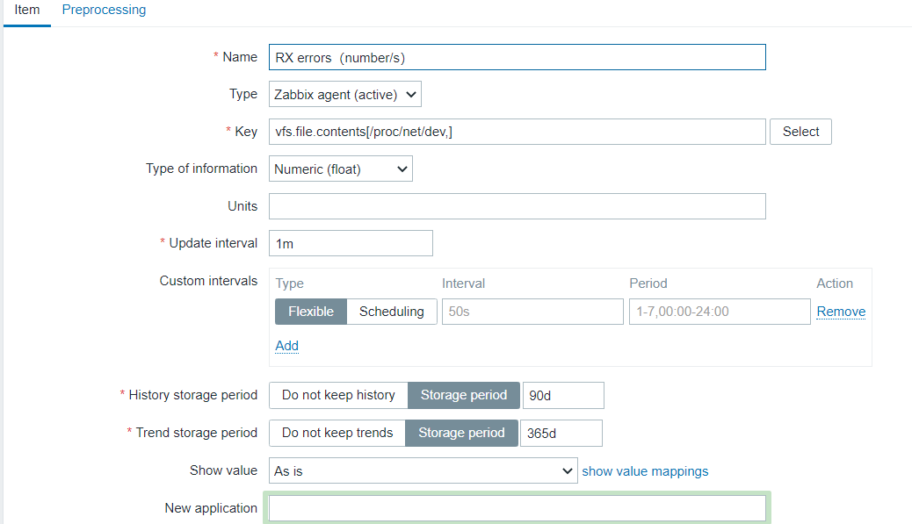
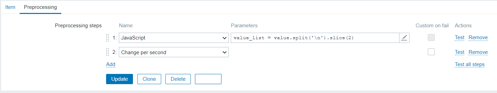
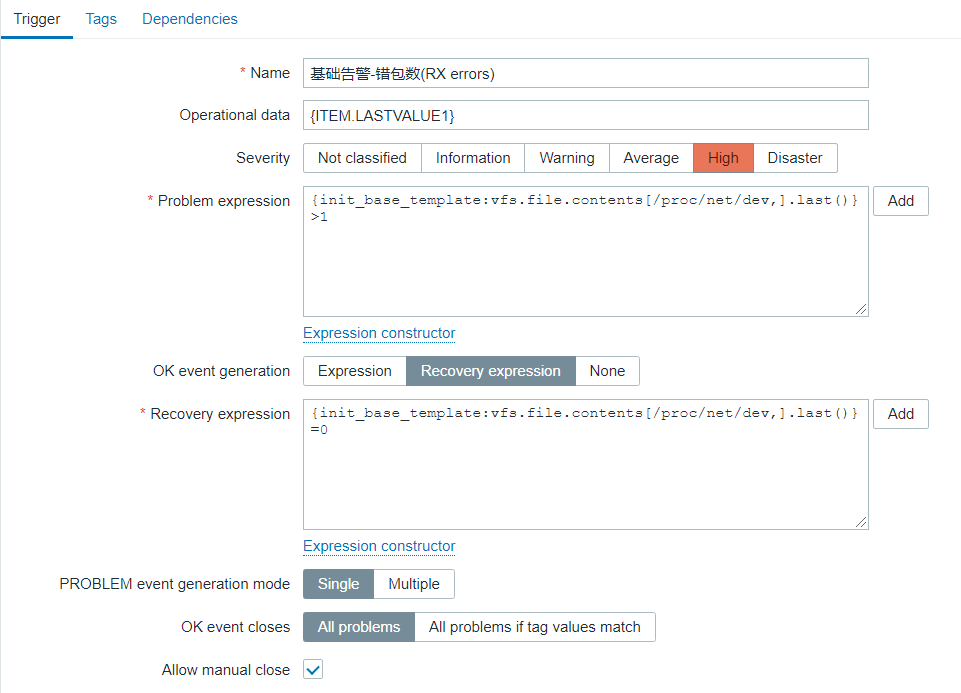

## 怎么查看网络错包数


#### 1、ifconfig

```shell
[root@server ~]# ifconfig
bond0: flags=5187<UP,BROADCAST,RUNNING,MASTER,MULTICAST>  mtu 1500
        inet 192.168.1.1  netmask 255.255.255.0  broadcast 192.168.1.255
        inet6 fe81::1266:dcff:feeb:6710  prefixlen 64  scopeid 0x20<link>
        ether 18:66:da:eb:67:10  txqueuelen 1000  (Ethernet)
        RX packets 7342322271  bytes 3260219046010 (2.9 TiB)
        RX errors 0  dropped 37  overruns 0  frame 0
        TX packets 6108635313  bytes 1619097536645 (1.4 TiB)
        TX errors 0  dropped 0 overruns 0  carrier 0  collisions 0
```

RX errors 0 表示当前网卡错包数为0


#### 2、/proc/net/dev


```shell
[root@server ~]# cat /proc/net/dev
Inter-|   Receive                                                |  Transmit
 face |bytes    packets errs drop fifo frame compressed multicast|bytes    packets errs drop fifo colls carrier compressed
vethc50bf17: 1798719   17603    0    0    0     0          0         0  2211512   17318    0    0    0     0       0          0
bond0: 3261653828988 7343321857    0   37    0     0          0 128381373 1619116041921 6108884429    0    0    0     0       0          0
lo: 23077647696 40811656    0    0    0     0          0         0 23077647696 40811656    0    0    0     0       0          0
docker0: 58844814  604435    0    0    0     0          0         0 438413267  586700    0    0    0     0       0          0
```


- bytes: The total number of bytes of data transmitted or received by the interface.（接口发送或接收的数据的总字节数）
- packets: The total number of packets of data transmitted or received by the interface.（接口发送或接收的数据包总数）
- **errs**: **The total number of transmit or receive errors detected by the device driver.（由设备驱动程序检测到的发送或接收错误的总数）**
- drop: The total number of packets dropped by the device driver.（设备驱动程序丢弃的数据包总数）
- fifo: The number of FIFO buffer errors.（FIFO缓冲区错误的数量）
- frame: The number of packet framing errors.（分组帧错误的数量）
- colls: The number of collisions detected on the interface.（接口上检测到的冲突数）
- compressed: The number of compressed packets transmitted or received by the device driver. (This appears to be unused in the 2.2.15 kernel.)（设备驱动程序发送或接收的压缩数据包数）
- carrier: The number of carrier losses detected by the device driver.（由设备驱动程序检测到的载波损耗的数量）
- multicast: The number of multicast frames transmitted or received by the device driver.（设备驱动程序发送或接收的多播帧数）


由此可得，该文件内的第四列为每个网卡的错报数，累加即可得linux总错报数


## 接入zabbix


zabbix agent一个自带监控项`vfs.file.contents[file,<encoding>]`，检索文件并返回其内容，具体可查阅官方文档


#### Item配置部分



#### 预处理

该监控项拿到的是整个文本内容，需要做二次处理，这里我们使用预处理的**JavaScript**


```javascript
// 切片去除前两行
value_list = value.split('\n').slice(2)

// 错包总数
var err_count = 0;

for (i = 0; i < value_list.length; i++) {
    // 去收尾空格，并以空格再次分隔取出第四列
    err_num = value_list[i].replace(/(^\s*)|(\s*$)/g, "").split(/\s+/)[3]
    if (err_num != undefined) {
        err_count += parseInt(err_num)
    }
}
return err_count
```


再加一个`Change per second`，计算每秒变化量，以便添加触发器




Test验证成功后添加即可


## 监控告警

trigger部分没什么好说的，看图


